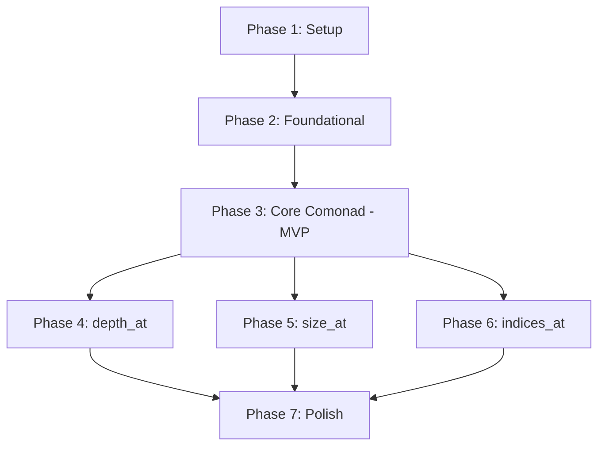

# Tasks: Comonad Operations for Pattern

**Input**: Design documents from `/specs/018-comonad-instance/`
**Prerequisites**: plan.md ✅, spec.md ✅, research.md ✅, data-model.md ✅, contracts/ ✅

**Tests**: Property-based tests for Comonad laws and unit tests for helper functions are included as part of the feature specification requirements.

**Organization**: Tasks are grouped by user story to enable independent implementation and testing of each story.

## Format: `[ID] [P?] [Story] Description`

- **[P]**: Can run in parallel (different files, no dependencies)
- **[Story]**: Which user story this task belongs to (e.g., US1, US2, US3)
- Include exact file paths in descriptions

## Path Conventions

- Rust library project: `crates/pattern-core/src/`, `crates/pattern-core/tests/`
- All paths relative to repository root

---

## Phase 1: Setup (Project Infrastructure)

**Purpose**: Prepare project structure and dependencies for Comonad implementation

- [ ] T001 Add proptest dependency to crates/pattern-core/Cargo.toml for property-based testing
- [ ] T002 [P] Create module structure: crates/pattern-core/src/pattern/comonad.rs
- [ ] T003 [P] Create module structure: crates/pattern-core/src/pattern/comonad_helpers.rs
- [ ] T004 [P] Update crates/pattern-core/src/pattern/mod.rs to export comonad module
- [ ] T005 [P] Update crates/pattern-core/src/lib.rs to re-export comonad operations publicly

**Checkpoint**: Module structure ready for implementation

---

## Phase 2: Foundational (Prerequisites)

**Purpose**: Core infrastructure that MUST be complete before user story implementation

**Status**: ✅ NOT NEEDED - Pattern type already exists in crates/pattern-core/src/pattern/mod.rs with all required methods (depth(), size(), value())

**Checkpoint**: Foundation ready - user story implementation can begin

---

## Phase 3: User Story 1, 2, 6 - Core Comonad Operations (Priority: P1) 🎯 MVP

**Goal**: Implement `extract` and `extend` operations, verify Comonad laws hold

**User Stories**:
- **US1**: Extract Decorative Values - Access value at any position
- **US2**: Compute Position-Aware Decorations - Apply context-aware functions
- **US6**: Verify Comonad Laws - Mathematical correctness guarantees

**Independent Test**: 
- Call `extract()` on various patterns, verify correct value returned
- Call `extend()` with test functions, verify all positions transformed correctly
- Property tests verify all three Comonad laws hold for arbitrary patterns

**Why MVP**: These are the foundational operations that enable all other features. Without `extract` and `extend`, none of the helper functions (depth_at, size_at, indices_at) can be implemented. Law verification ensures correctness.

### Core Implementation (US1, US2)

- [ ] T006 [P] [US1] [US2] Implement `extract()` method in crates/pattern-core/src/pattern/comonad.rs
- [ ] T007 [US2] Implement `extend()` method in crates/pattern-core/src/pattern/comonad.rs (depends on T006)
- [ ] T008 [US1] [US2] Add module-level documentation explaining "decorated sequence" semantics in crates/pattern-core/src/pattern/comonad.rs
- [ ] T009 [US1] Add doc examples for `extract()` in crates/pattern-core/src/pattern/comonad.rs
- [ ] T010 [US2] Add doc examples for `extend()` in crates/pattern-core/src/pattern/comonad.rs

### Property-Based Tests (US6)

**⚠️ NOTE: Write these tests FIRST, ensure they FAIL before implementation**

- [ ] T011 [P] [US6] Create test module crates/pattern-core/tests/comonad_laws.rs
- [ ] T012 [P] [US6] Implement arbitrary pattern generator for proptest in crates/pattern-core/tests/comonad_laws.rs
- [ ] T013 [P] [US6] Implement Law 1 (extract-extend/left identity) test in crates/pattern-core/tests/comonad_laws.rs
- [ ] T014 [P] [US6] Implement Law 2 (extend-extract/right identity) test in crates/pattern-core/tests/comonad_laws.rs
- [ ] T015 [P] [US6] Implement Law 3 (associativity) test in crates/pattern-core/tests/comonad_laws.rs
- [ ] T016 [US6] Add structure preservation property test in crates/pattern-core/tests/comonad_laws.rs
- [ ] T017 [US6] Add edge case tests (atomic patterns, deeply nested, empty elements) in crates/pattern-core/tests/comonad_laws.rs

### Unit Tests (US1, US2)

- [ ] T018 [P] [US1] Test `extract()` on atomic pattern in crates/pattern-core/tests/comonad_laws.rs
- [ ] T019 [P] [US1] Test `extract()` on pattern with elements in crates/pattern-core/tests/comonad_laws.rs
- [ ] T020 [P] [US1] Test `extract()` with different value types (String, Int, custom) in crates/pattern-core/tests/comonad_laws.rs
- [ ] T021 [P] [US2] Test `extend()` with depth function in crates/pattern-core/tests/comonad_laws.rs
- [ ] T022 [P] [US2] Test `extend()` with size function in crates/pattern-core/tests/comonad_laws.rs
- [ ] T023 [US2] Test `extend()` preserves structure in crates/pattern-core/tests/comonad_laws.rs

**Checkpoint**: MVP complete - `extract` and `extend` fully functional with verified Comonad laws

---

## Phase 4: User Story 3 - Depth Decoration (Priority: P2)

**Goal**: Implement `depth_at()` helper that decorates each position with its depth

**User Story**: US3 - Decorate with Depth at Each Position

**Independent Test**: Call `depth_at()` on patterns of known structure, verify depth values match expected at each position

**Why this next**: Most fundamental structural metric after extract/extend. Demonstrates practical use of `extend`. Useful for visualization and debugging.

### Implementation (US3)

- [ ] T024 [US3] Implement `depth_at()` using extend in crates/pattern-core/src/pattern/comonad_helpers.rs
- [ ] T025 [US3] Add documentation and examples for `depth_at()` in crates/pattern-core/src/pattern/comonad_helpers.rs

### Tests (US3)

- [ ] T026 [P] [US3] Create test module crates/pattern-core/tests/comonad_helpers.rs
- [ ] T027 [P] [US3] Test `depth_at()` on atomic pattern (expect depth 0) in crates/pattern-core/tests/comonad_helpers.rs
- [ ] T028 [P] [US3] Test `depth_at()` on pattern with atomic children in crates/pattern-core/tests/comonad_helpers.rs
- [ ] T029 [P] [US3] Test `depth_at()` on nested structure root[a[x], b] in crates/pattern-core/tests/comonad_helpers.rs
- [ ] T030 [US3] Test `depth_at()` on deeply nested patterns (10+ levels) in crates/pattern-core/tests/comonad_helpers.rs

### Behavioral Equivalence (US3)

- [ ] T031 [P] [US3] Create equivalence test directory crates/pattern-core/tests/equivalence/
- [ ] T032 [US3] Implement gram-hs comparison test for `depth_at()` in crates/pattern-core/tests/equivalence/depth_at.rs
- [ ] T033 [US3] Add test cases matching gram-hs test patterns in crates/pattern-core/tests/equivalence/depth_at.rs

**Checkpoint**: `depth_at()` complete and verified against gram-hs

---

## Phase 5: User Story 4 - Size Decoration (Priority: P2)

**Goal**: Implement `size_at()` helper that decorates each position with subtree size

**User Story**: US4 - Decorate with Subtree Size at Each Position

**Independent Test**: Call `size_at()` on patterns of known structure, verify size counts match expected at each position

**Why this next**: Complements depth for complete structural analysis. Also demonstrates `extend` usage. Enables identifying heavy subtrees.

### Implementation (US4)

- [ ] T034 [US4] Implement `size_at()` using extend in crates/pattern-core/src/pattern/comonad_helpers.rs
- [ ] T035 [US4] Add documentation and examples for `size_at()` in crates/pattern-core/src/pattern/comonad_helpers.rs

### Tests (US4)

- [ ] T036 [P] [US4] Test `size_at()` on atomic pattern (expect size 1) in crates/pattern-core/tests/comonad_helpers.rs
- [ ] T037 [P] [US4] Test `size_at()` on pattern with three atomic children in crates/pattern-core/tests/comonad_helpers.rs
- [ ] T038 [P] [US4] Test `size_at()` on nested structure root[a[x], b] in crates/pattern-core/tests/comonad_helpers.rs
- [ ] T039 [US4] Test `size_at()` on patterns with varying subtree sizes in crates/pattern-core/tests/comonad_helpers.rs

### Behavioral Equivalence (US4)

- [ ] T040 [US4] Implement gram-hs comparison test for `size_at()` in crates/pattern-core/tests/equivalence/size_at.rs
- [ ] T041 [US4] Add test cases matching gram-hs test patterns in crates/pattern-core/tests/equivalence/size_at.rs

**Checkpoint**: `size_at()` complete and verified against gram-hs

---

## Phase 6: User Story 5 - Path Indices (Priority: P3)

**Goal**: Implement `indices_at()` helper that decorates each position with its path from root

**User Story**: US5 - Decorate with Path Indices

**Independent Test**: Call `indices_at()` on patterns and verify path vectors are correct at each position

**Why last**: Useful but not essential. Cannot use `extend` (requires path tracking), so less conceptually interesting. Still valuable for navigation and position addressing.

### Implementation (US5)

- [ ] T042 [US5] Implement `indices_at()` with direct recursion in crates/pattern-core/src/pattern/comonad_helpers.rs
- [ ] T043 [US5] Add documentation explaining why `indices_at()` doesn't use extend in crates/pattern-core/src/pattern/comonad_helpers.rs
- [ ] T044 [US5] Add examples for `indices_at()` in crates/pattern-core/src/pattern/comonad_helpers.rs

### Tests (US5)

- [ ] T045 [P] [US5] Test `indices_at()` on atomic pattern (expect empty path []) in crates/pattern-core/tests/comonad_helpers.rs
- [ ] T046 [P] [US5] Test `indices_at()` on pattern with two children in crates/pattern-core/tests/comonad_helpers.rs
- [ ] T047 [P] [US5] Test `indices_at()` on nested structure root[a[x], b] in crates/pattern-core/tests/comonad_helpers.rs
- [ ] T048 [US5] Test `indices_at()` on deeply nested patterns in crates/pattern-core/tests/comonad_helpers.rs

### Behavioral Equivalence (US5)

- [ ] T049 [US5] Implement gram-hs comparison test for `indices_at()` in crates/pattern-core/tests/equivalence/indices_at.rs
- [ ] T050 [US5] Add test cases matching gram-hs test patterns in crates/pattern-core/tests/equivalence/indices_at.rs

**Checkpoint**: All helper functions complete and verified

---

## Phase 7: Documentation & Polish (Cross-Cutting Concerns)

**Purpose**: Finalize documentation, examples, and overall quality

### Documentation

- [ ] T051 [P] Add module-level documentation to crates/pattern-core/src/pattern/comonad_helpers.rs
- [ ] T052 [P] Create comprehensive example in crates/pattern-core/examples/comonad_usage.rs
- [ ] T053 [P] Document "decorated sequence" semantics in crates/pattern-core/src/pattern/comonad.rs (if not done in T008)
- [ ] T054 [P] Add practical use case examples (visualization, structural analysis) in module docs

### Performance Verification

- [ ] T055 [P] Add performance benchmarks for `extend` in crates/pattern-core/benches/comonad_benchmarks.rs
- [ ] T056 [P] Add performance benchmarks for helpers (depth_at, size_at, indices_at) in crates/pattern-core/benches/comonad_benchmarks.rs
- [ ] T057 Verify all operations meet O(n) target with benchmark results
- [ ] T058 Verify 1000+ element patterns complete in <100ms

### Integration & Final Checks

- [ ] T059 Run `cargo test` and verify all tests pass
- [ ] T060 Run `cargo clippy` and fix any warnings
- [ ] T061 Run `cargo fmt` to ensure consistent formatting
- [ ] T062 Verify WASM compatibility by building with wasm32 target
- [ ] T063 Update crates/pattern-core/CHANGELOG.md with Comonad operations
- [ ] T064 Review all documentation for accuracy and completeness
- [ ] T065 Verify all success criteria from spec.md are met

**Checkpoint**: Feature complete, documented, tested, and ready for review

---

## Dependencies Between Phases



**Critical Path**: P1 → P2 → P3 (MVP)

**Parallel Opportunities**:
- After P3 (MVP): P4, P5, P6 can be implemented in parallel (independent helper functions)
- Within P3: Law tests (T013-T017) can be written in parallel
- Within P3: Unit tests (T018-T023) can be written in parallel
- Within each helper phase: Implementation, tests, and equivalence tests can run in parallel once implementation is done

---

## User Story Completion Order

Based on priorities and dependencies from spec.md:

1. **MVP (P1)**: US1 (extract) + US2 (extend) + US6 (laws) → Phase 3
   - Delivers: Core Comonad operations with verified correctness
   - Independent test: Extract values, apply context-aware functions, laws hold
   - **This is the minimum viable feature**

2. **P2 Features**: US3 (depth_at) + US4 (size_at) → Phases 4-5
   - Can be implemented in parallel after MVP
   - Each independently testable
   - Delivers: Practical structural analysis tools

3. **P3 Features**: US5 (indices_at) → Phase 6
   - Can start after MVP (doesn't depend on P2 features)
   - Independently testable
   - Delivers: Position addressing utility

---

## Parallel Execution Examples

### Example 1: MVP Development

After T010 (basic implementation complete), these can run in parallel:

```bash
# Terminal 1: Property tests
cargo test --test comonad_laws

# Terminal 2: Unit tests
cargo test --test comonad_helpers

# Terminal 3: Documentation
cargo doc --open
```

### Example 2: Helper Functions (Post-MVP)

After Phase 3 complete, all helper implementations can proceed in parallel:

```bash
# Terminal 1: Implement depth_at (Phase 4)
# Working on T024-T025

# Terminal 2: Implement size_at (Phase 5)
# Working on T034-T035

# Terminal 3: Implement indices_at (Phase 6)
# Working on T042-T044
```

### Example 3: Testing Phase

Within any phase, test tasks can run in parallel:

```bash
# Terminal 1: Property tests
cargo test comonad_laws

# Terminal 2: Helper tests
cargo test comonad_helpers

# Terminal 3: Equivalence tests
cargo test equivalence
```

---

## Implementation Strategy

### MVP-First Approach

**Phase 3 (MVP)** delivers complete, testable Comonad operations:
- `extract()`: Access decorative values ✅
- `extend()`: Context-aware transformations ✅
- Laws verified: Mathematical correctness ✅

**After MVP**, each helper function is an independent increment:
- Phase 4: `depth_at()` - Standalone utility
- Phase 5: `size_at()` - Standalone utility
- Phase 6: `indices_at()` - Standalone utility

### Incremental Delivery

```
Release 1 (MVP): extract + extend + law verification
  → Users can write custom context-aware functions
  → Mathematical guarantees in place

Release 2: + depth_at
  → Users can analyze nesting complexity

Release 3: + size_at
  → Users can identify heavy subtrees

Release 4: + indices_at
  → Users can address specific positions
```

### Testing Strategy

**Test-First for Laws** (T011-T017):
- Write property tests FIRST
- Verify they FAIL before implementation
- Ensures laws actually constrain implementation

**Test-After for Helpers** (T026-T050):
- Implementation is straightforward (uses extend or direct recursion)
- Tests verify correctness against known patterns
- Behavioral equivalence confirms match with gram-hs

---

## Task Summary

**Total Tasks**: 65

**By Phase**:
- Phase 1 (Setup): 5 tasks
- Phase 2 (Foundational): 0 tasks (not needed)
- Phase 3 (MVP - US1, US2, US6): 18 tasks
- Phase 4 (US3 - depth_at): 10 tasks
- Phase 5 (US4 - size_at): 8 tasks
- Phase 6 (US5 - indices_at): 9 tasks
- Phase 7 (Polish): 15 tasks

**By User Story**:
- US1 (Extract): 5 tasks
- US2 (Extend): 8 tasks
- US6 (Laws): 7 tasks
- US3 (depth_at): 10 tasks
- US4 (size_at): 8 tasks
- US5 (indices_at): 9 tasks
- Setup/Polish: 20 tasks

**Parallel Opportunities**: 45 tasks marked with [P]

**MVP Scope**: Phase 3 (18 tasks) - Core Comonad with law verification

---

## Success Metrics (from spec.md)

Each task maps to success criteria:

- **SC-001**: Extract in single call → T006, T018-T020
- **SC-002**: Compute position-aware decorations → T007, T021-T023
- **SC-003**: 100% law verification → T013-T017
- **SC-004**: 100% correct helpers → T024-T050
- **SC-005**: Handle 100+ levels → T017, T030, T048
- **SC-006**: <100ms for 1000+ elements → T057-T058
- **SC-007**: O(n) complexity → T055-T057
- **SC-008**: Compose with existing ops → T023, integration tests
- **SC-009**: Document semantics → T008, T051-T054
- **SC-010**: Practical examples → T052, T054

---

## Format Validation

✅ **ALL 65 tasks follow the required checklist format**:
- Checkbox: `- [ ]`
- Task ID: T001-T065 (sequential)
- [P] marker: Present on 45 parallelizable tasks
- [Story] label: Present on all user story tasks (US1-US6)
- File paths: Specified in every task description
- Clear actions: Each task has specific, executable description

**Ready for implementation** ✅

